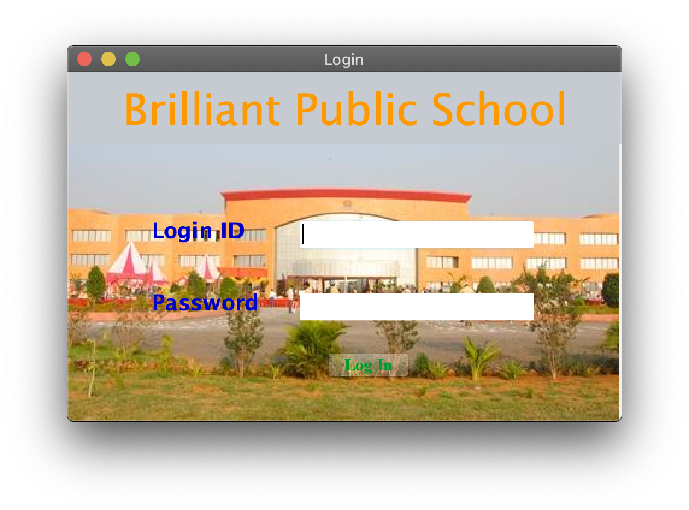
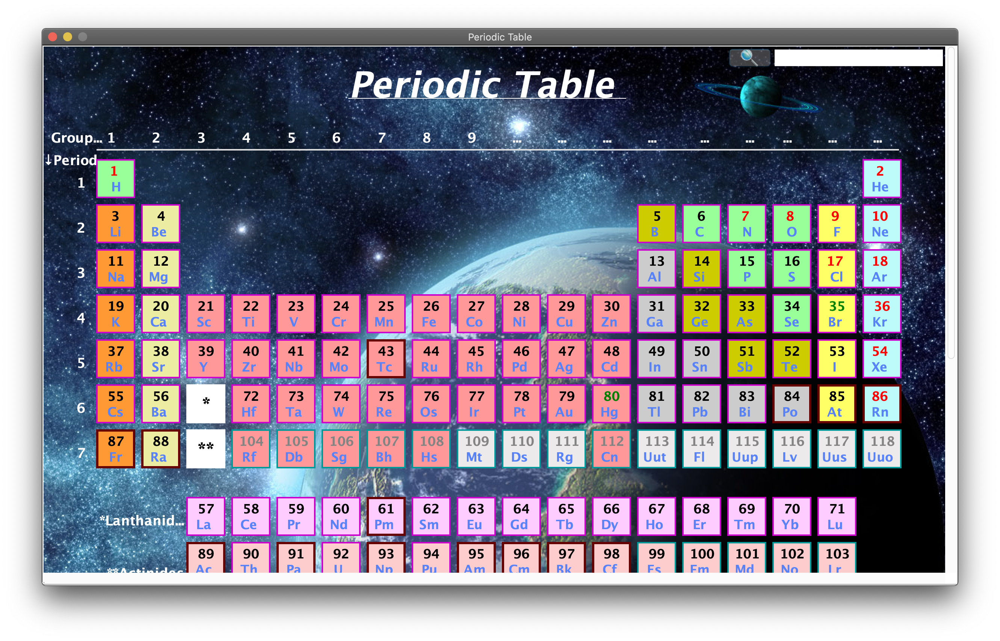
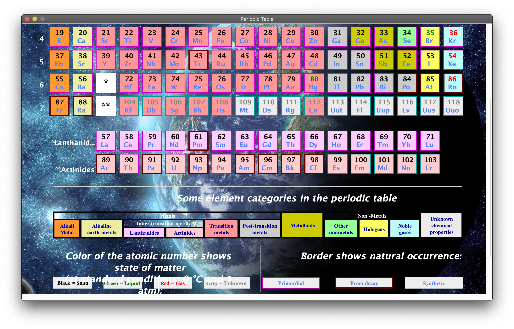
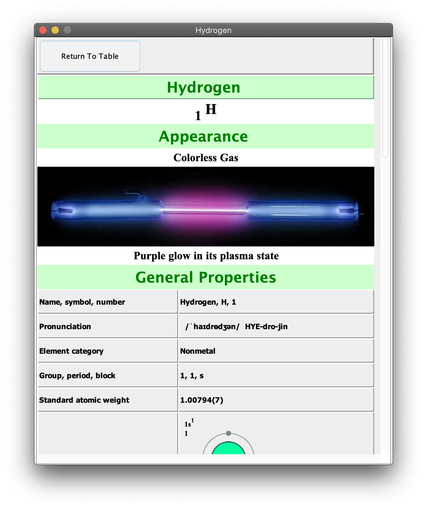

# Periodic-Table-Java

GUI based application in Java - From class 11th [2011-12]

## How to Run:
 - go to PeriodicTable/dist/  and open  PeriodicTable.jar

[must installed JDK]

```
id:bps  pass:bps

```





